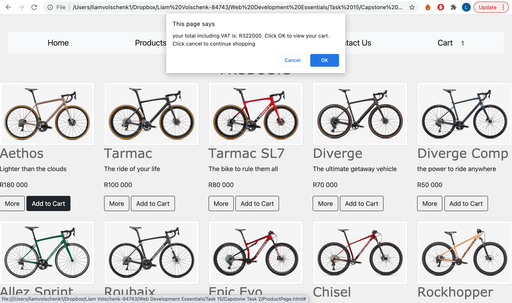
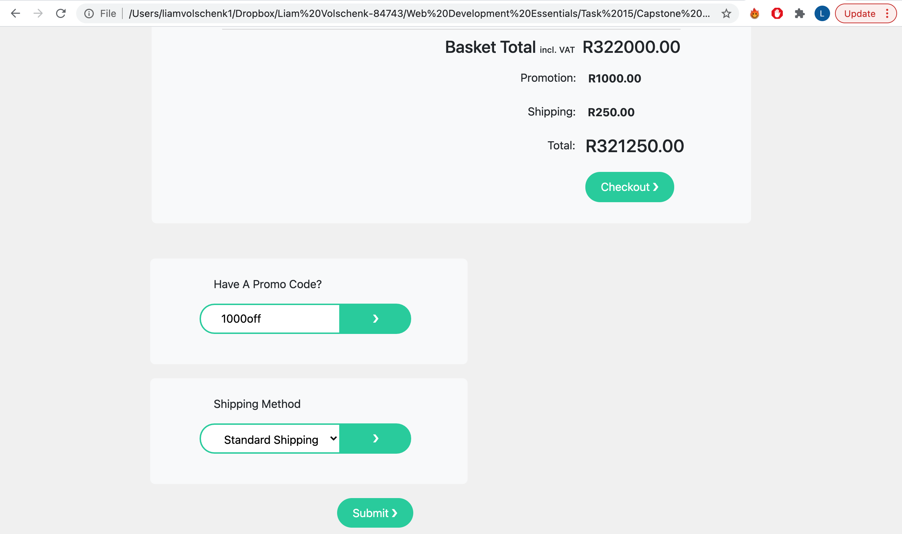
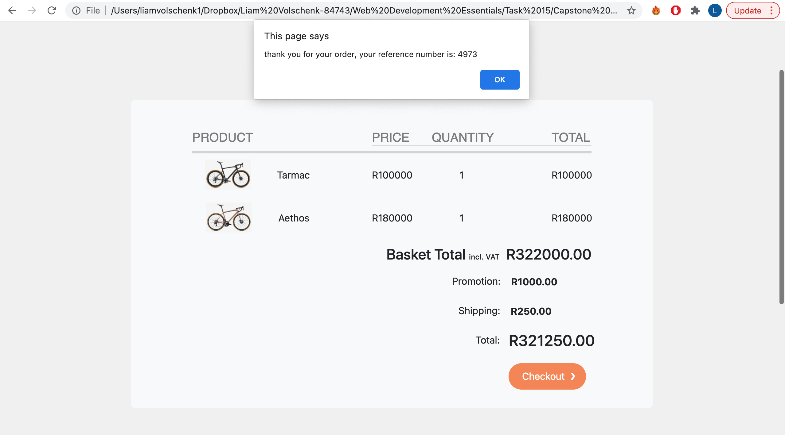

# Online-Store-Capstone

<!-- TABLE OF CONTENTS -->
<details open="open">
  <summary>Table of Contents</summary>
  <ol>
    <li>
      <a href="#about-the-project">About The Project</a>
    </li>
    <li>
      <a href="#built-with">Built With</a>
    </li>
    <li>
      <a href="#install-the-project-locally">Install the project locally</a>
    </li>
    <li>
      <a href="#using-the-website">Usage</a>
    </li>
    <li>
      <a href="#credits">Credits</a>
    </li>
  </ol>
</details>

## About the project

This is a functioning front-end of an online store. You are able to add products from a catalogue and product pages to a seperate cart page. You are also able to apply a promo
code for a discount as well as shipping costs to your total. Users are alerted to their basket total when adding new products to their cart. When the user is happy to "checkout",
they are given a unique refernce number for their order.

<hr>

## Built with
* HTML
* [Bootstrap](https://getbootstrap.com)
* CSS
* JavaScript
* [JQuery](https://jquery.com)

<hr>

## Install the project locally

* Open your terminal and go change your current working directory to the location where you want the cloned directory

  eg: ```cd user/files/project```
  
* Clone the repository using *git clone* and the repository URL which can be found by clicking the *code* tab on the repository page
  
  ```git clone https://github.com/liamvolschenk/Online-Store-Capstone.git```
  
* Press ```Enter``` to clone the repository

<hr>

## Using the website

Users can access the product catalogue and add products to their cart from this page by pressing the add to cart button, when they add something to their cart they will recieve an alert with
their current basket total as well as the option to go to their cart.



The cart:


Users are also able to apply a promo code to recieve a discount (the promo code has been hard coded as "1000off") as well as shipping, the user sees a summary of these and when they press the submit 
button they will get an updated total.



When a user is ready to checkout they press the checkout button and they are given a unique reference number for their order.



<hr>

## Credits

This project was built by Liam Volschenk - liamvolschenk@gmail.com

<hr>

